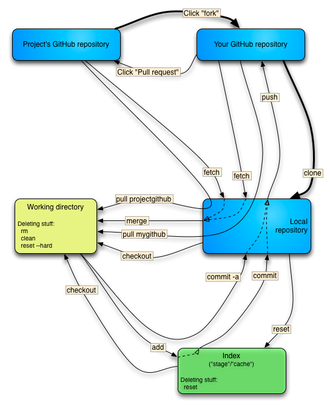

# beyond git guis
## a plea to start using the CLI
Learn from my pain

---

<!-- .slide: data-background="infinity-gauntlet-stones.jpg" -->


---


## git should be part of your toolbox

* regular expressions
* networking
* __git__


Notes:
I recently cleared up my library of books. I threw away many books pertaining to 
technologies that are by now obsolete, like flash or ExtJS. There are some technologies, though,
that are so fundamental that a solid knowledge is going to help you time and time 
again.


---


## Don't use git like a baby

* SourceTree
* GitKraken
* embedded git engines
* gitlab
* github

These 'helpers' make simple things trivial, and complicated things impossible

---


## Disadvantages of git GUIs

* not portable
* force you to work 'their' way
* hide or ignore the hidden gems
* twist git so that it looks like a usual source control system
---


## Advantages of git GUIs

* super for branch visualisation
* super for merging
* hides or masks some of the inconsistencies


---

## Once you start using git on the CLI

* learn once, use everywhere
* you can repair yourself out of the worst disasters
* you can repair your colleague's disasters
* git status is your friend and will teach you with helpful hints
* your knowledge will not plateau


---


## Major stumbling blocks

* git is decentralized.
    * there is **no** central repository
* the naming of functions is horrible


---

# Essentials

---

## Grokking commits


* a tree of commits
* every commit is a snapshot of your whole code
* commits point to their ancestor
    * merge commits have two ancestors
    * initial commit has none
* a branch is just a pointer to a commit


---

## Understand your buckets
© Steven Bennet

<!-- .element: height="500px" -->

---

## Understand your buckets

your **working directory** is a sandbox. 

The files are not important. 

This is upsetting.


---

# Completely confusing
## Am I dumb or is this completely confusing?

---

# Completely confusing
## Coming from another source control system

---

## git is not your grandma's source control

* git is decentralized.
    * there is **no** central repository
    * git guis try to recreate this
* `git checkout` doesn't mean checkout
    * (in the sense 'reserve for me')
* your local repository contains all the commits of the remotes
    * e.g. `origin/develop` sits next to your **local** `master`


---
# Completely confusing
## Confusing commands

---


Most confusing command is

```shell
$ git checkout
```
* completely overloaded
    * switch from one branch to another
    * create a new branch and switch to it
    * copy files from one branch to another branch
* NOT 'reserve this file so only I can modify it'


---

```shell
$ git checkout feature/new_function
```

switch current branch to `feature/new_function`


---

```shell
$ git checkout -b feature/experimental_regex
```

equivalent to 

```shell
$ git branch feature/experimental_regex # create new branch
$ git checkout feature/experimental_regex # switch to it
```

---

```shell
$ git checkout --track origin/feature/new_from_colleague
```

equivalent to 

'copy' a branch from a remote onto your local one


---

```shell
$ git checkout my_friends_branch -- app/img/
```

copies all the files from the directory `app/img` of 

`my_friends_branch` into **my** working directory


---

```shell
$ git checkout .
```

Overwrite my working directory with the latest commit


---

```shell
$ git checkout -
```

switch branch to the latest one I was using


---
# Beelzebub's corner

---

```shell
$ git revert
```

truly evil.

Does not rollback your changes. Instead, creates a new commit to
cancel out your changes.


---

```shell
$ git rebase
$ git push --force
```

Can really upset your colleagues. You're rewriting their history.


---

```shell
$ git reset --hard
```

Will completely overwrite your working directory. Sharp knife!


---
# Superpowers


---
## git time machine

```shell
$ git reflog # where do I want to go
```

```shell
$ git reset HEAD@{2}
```

---
## Your commits as a loose list of *changes*

You start getting superpowers when you start understanding that commits
should not be a tightly-linked list of chronological changes

When you make good commits which represents ideas/changes...

```shell
$ git cherry-pick
```

is wonderful


---
## using Hunks

Hunks:
craft your commits to include only certain combinations and parts of files


```shell
$ git add -p
```

or

```shell
$ git commit -p
``` 


---
## rewrite your local history

```shell
$ git rebase -i
```

Interactive rebase. Beautiful!


---
## cleanup your working directory

```shell
$ git clean -f -d
```

---

Thanks to my git mentor, Pablo a.k.a escodebar


---


## Resources

* [10 things I hate about Git](https://stevebennett.me/2012/02/24/10-things-i-hate-about-git/)
* [Cynefin](https://cognitive-edge.com/videos/cynefin-framework-introduction/)
* [Git Magic](http://www-cs-students.stanford.edu/~blynn/gitmagic/ch08.html)
* [Git Reference](https://git-scm.com/docs/)
* [Git is simpler](http://nfarina.com/post/9868516270/git-is-simpler)
* [Oh shit Git!](https://ohshitgit.com/)
* [Pro Git](https://git-scm.com/book/en/v2)
* [The thing about Git](https://tomayko.com/blog/2008/the-thing-about-git)
* [Think like a Git](http://think-like-a-git.net/)
* [Why Git is Better than X](http://web.archive.org/web/20090210020404id_/http://whygitisbetterthanx.com/#the-staging-area)

---

## Questions & Feedback

---

 
